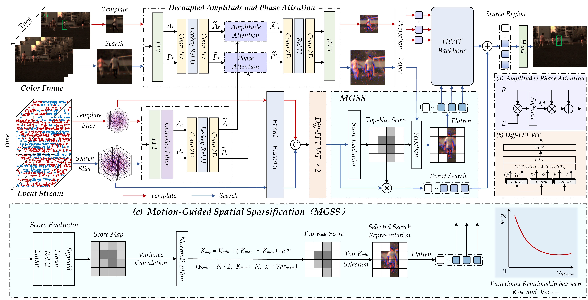
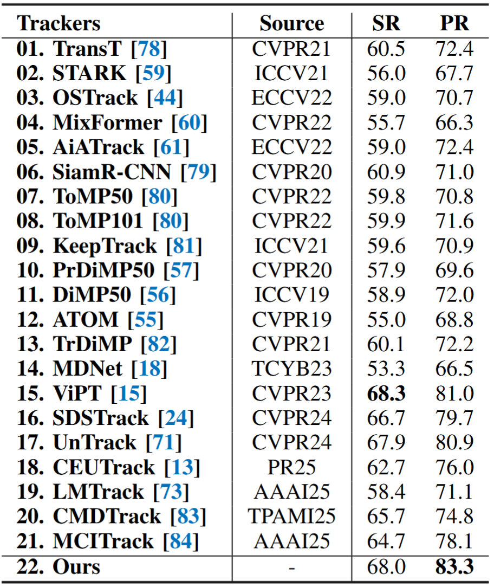

# 🔎 APMTrack
**Decoupling Amplitude and Phase Attention in Frequency Domain for RGB-Event based Visual Object Tracking** 

Shiao Wang, Xiao Wang*, Haonan Zhao, Jiarui Xu, Bo Jiang*, Lin Zhu, Xin Zhao, Yonghong Tian, Jin Tang

[[Paper]()]
[[Code](https://github.com/Event-AHU/OpenEvTracking/edit/main/APMTrack/)]


# :dart: Abstract 
Existing RGB–Event visual object tracking approaches primarily rely on conventional feature-level fusion, failing to fully exploit the unique advantages of event cameras. In particular, the high dynamic range and motion-sensitive nature of event cameras are often overlooked, while low-information regions are processed uniformly, leading to unnecessary computational overhead for the backbone network. To address these issues, we propose a novel tracking framework that performs early fusion in the frequency domain, enabling effective aggregation of high-frequency information from the event modality. Specifically, RGB and event modalities are transformed from the spatial domain to the frequency domain via the Fast Fourier Transform, with their amplitude and phase components decoupled. High-frequency event information is selectively fused into RGB modality through amplitude and phase attention, enhancing feature representation while substantially reducing backbone computation. In addition, a motion-guided spatial sparsification module leverages the motion-sensitive nature of event cameras to capture the relationship between target motion cues and spatial probability distribution, filtering out low-information regions and enhancing target-relevant features. Finally, a sparse set of target-relevant features is fed into the backbone network for learning, and the tracking head predicts the final target position. Extensive experiments on three widely used RGB–Event tracking benchmark datasets, including FE108, FELT, and COESOT, demonstrate the high performance and efficiency of our method.

### Framework 

<p align="center">
  
</p>

An overview of our proposed **A**mplitude–**P**hase attention and **M**otion-guided sparsification framework for efficient RGB-Event tracking, called APMTrack. Specifically, RGB and event inputs are first decoupled into amplitude and phase in the frequency domain, allowing high-frequency event information to enhance RGB modality via amplitude and phase attention. The event encoder extracts motion cues, which are refined by the FFT-based differential ViT, and subsequently guide a spatial sparsification module for adaptive Top-$K$ token selection. The selected search tokens, combined with template features, are processed by the backbone, and the tracking head predicts the final target location.


# :collision: Update Log 


# :hammer: Environment 

Install env
```
conda create -n apmtrack python=3.10
conda activate apmtrack
pip install -r requirements.txt
```

You can also modify paths by editing these two files
```
lib/train/admin/local.py  # paths about training
lib/test/evaluation/local.py  # paths about testing
```

Download pretrained model [[SUTRACK_ep0180.pth.tar](https://pan.baidu.com/s/187w8ejD4VZZBz6buPKMTQA?pwd=AHUE)] and put it under `$/pretrained_models` for training.

Download the trained model weight from [[APMTrack_ep0050.pth](https://pan.baidu.com/s/1jeNPb3Xod_4X0lshTQlSBg?pwd=AHUE)] and put it under `$/output/checkpoints/train/apmtrack/apmtrack_coesot` for testing directly.

**Tracking Results on the COESOT dataset**

[[Tracking Results](https://pan.baidu.com/s/1vkC8fNisBqmIPjXzWvveWA?pwd=wsad)]

## Train & Test
```
# train
bash train.sh

# test
bash test.sh
```


# :chart_with_upwards_trend: Benchmark Results
The overall performance evaluation on the COESOT dataset.

<p align="left">
  
</p>


# :cupid: Acknowledgement 
* Thanks for the  [CEUTrack](https://github.com/Event-AHU/COESOT), [OSTrack](https://github.com/botaoye/OSTrack), [PyTracking](https://github.com/visionml/pytracking), [SUTrack](https://github.com/chenxin-dlut/SUTrack) and [ViT](https://github.com/rwightman/pytorch-image-models) library for a quickly implement.

# :newspaper: Citation 
```bibtex

```


